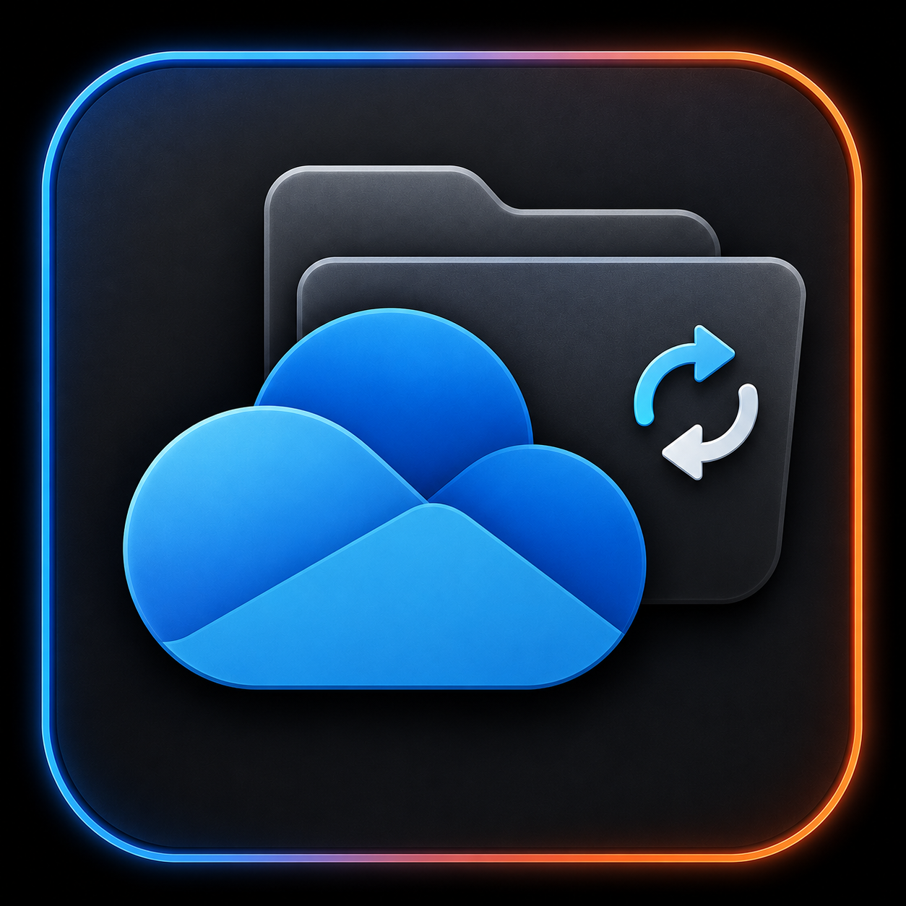

<p align="center"></p>

# OneSync

> Controlled selective Microsoft OneDrive sync for Unraid.

[简体中文](README.md) | [Issues](../../issues)

OneSync runs the maintained [`abraunegg/onedrive`](https://github.com/abraunegg/onedrive) client. Selected folders are real files on Unraid, not an rclone FUSE mount. Run a one-time sync when you want to upload local changes and download cloud changes.

## Highlights

- Selective sync from a browser folder tree.
- Separate device-code authorization for OneDrive engine and Microsoft Graph.
- Dry-run before confirmed resync after scope changes.
- No forced overwrite or `--cleanup-local-files`.
- One-time sync by default. Continuous monitoring stays off.

## Deploy

Use Unraid Compose Manager:

```yaml
services:
  onesync:
    image: ghcr.io/Wning-ady/onesync:latest
    container_name: onesync
    environment:
      PUID: "99"
      PGID: "100"
      TZ: Asia/Shanghai
      GRAPH_CLIENT_ID: replace-with-your-entra-client-id
      GRAPH_TENANT_ID: 5dldn8.onmicrosoft.com
    ports: ["8098:8098"]
    volumes:
      - /mnt/user/appdata/onesync:/onedrive/conf
      - /mnt/user/onedrive:/onedrive/data
    restart: unless-stopped
```

Open `http://<unraid-ip>:8098` only on a trusted LAN, VPN, or protected reverse proxy.

## Microsoft Entra setup

Create a single-tenant public client. Enable public client flows. Add redirect URIs `http://127.0.0.1:53100/` and `https://login.microsoftonline.com/common/oauth2/nativeclient`. Grant delegated `Files.ReadWrite.All`, `User.Read`, and `offline_access`, then grant admin consent. Put Application (client) ID in `GRAPH_CLIENT_ID`. Do not use a client secret.

## First sync

1. Click **Sync once** and complete OneDrive device-code authorization from the log.
2. Click **Connect Graph** and complete the second device-code authorization.
3. Load folders, select scope, save, then run **Controlled resync**.
4. Resync performs dry-run first and remains stopped on completion. Click **Sync once** for later changes.

## Storage and safety

- Data: `/mnt/user/onedrive`
- Private configuration and OAuth tokens: `/mnt/user/appdata/onesync`
- `sync_list` lives at `/onedrive/conf/sync_list`.
- Back up data and configuration before state recovery. Do not delete configuration databases to troubleshoot.

## Images

- `ghcr.io/Wning-ady/onesync:latest`
- `docker.io/<DOCKERHUB_USERNAME>/onesync:latest`

GitHub Actions publishes GHCR on `main` or `v*`. Docker Hub publishing needs `DOCKERHUB_USERNAME` and `DOCKERHUB_TOKEN` repository secrets.
